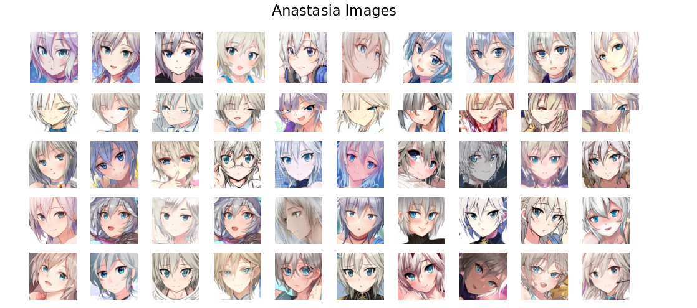
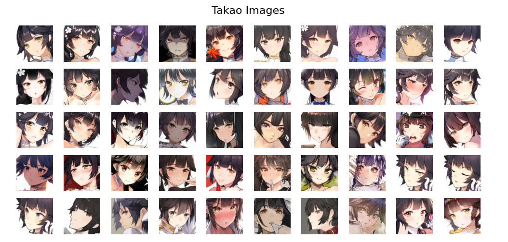
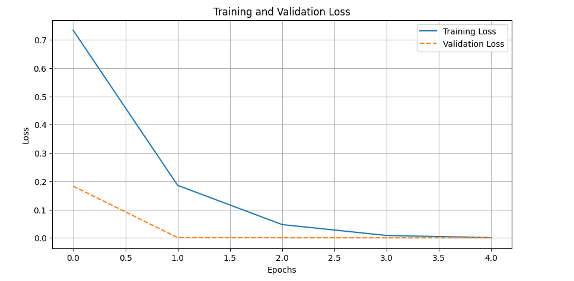
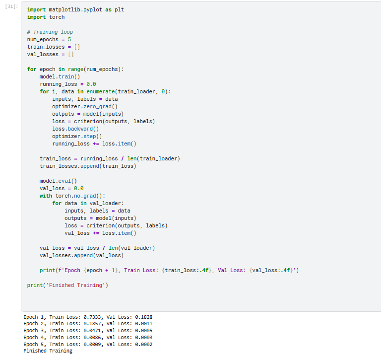
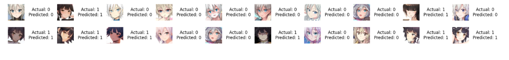
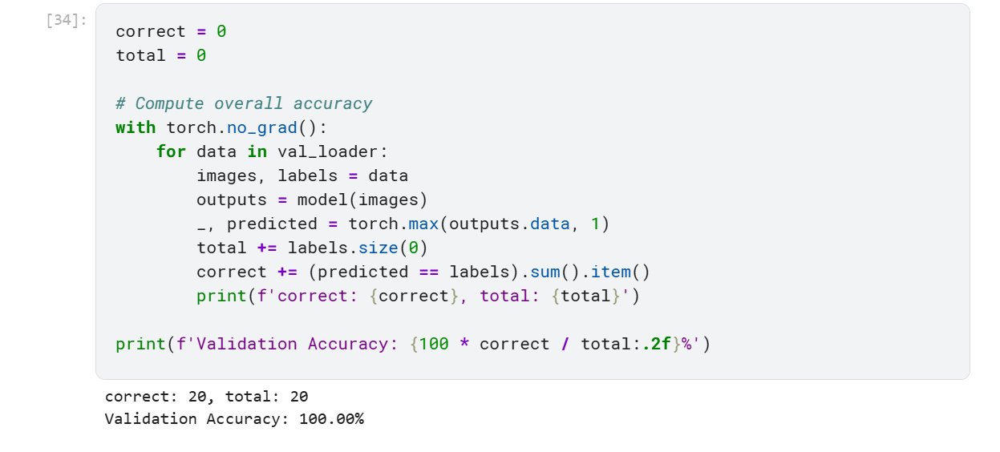

# Anime Image Classification using CNN

## 📌 Overview
This project implements a Convolutional Neural Network (CNN) to classify anime character images
into multiple classes. The project focuses on building an end-to-end deep learning pipeline,
starting from data preprocessing and model design to training, evaluation, and visualization.

## 🧠 Motivation
The main goal of this project is to strengthen practical skills in computer vision and deep learning,
with a particular focus on CNN-based image classification using PyTorch.
The project is designed to be educational, well-structured, and suitable for showcasing on GitHub.

## 📊 Dataset
- Dataset: AniWho (subset)
- Number of images: ~9,700
- Number of classes: 130
- Task: Multi-class image classification
- Data source: Danbooru (anime character faces)

### Dataset Samples




## ⚙️ Model Architecture
The model used in this project is a custom Convolutional Neural Network (CNN) composed of:
- Convolutional layers for feature extraction
- Pooling layers for spatial downsampling
- Fully connected layers for classification
- Softmax activation at the output layer

The architecture is designed to balance performance and simplicity, making it suitable
for learning and experimentation.

## 🏋️ Training Setup
- Framework: PyTorch
- Loss function: CrossEntropyLoss
- Optimizer: Adam / SGD
- Batch size: Defined in the notebook
- Number of epochs: Defined in the notebook
- Hardware: CPU / GPU (if available)

## 📈 Results

### Training Performance

**Training Loss Curves**




### Sample Predictions
The following examples show model predictions compared to the ground truth labels.





## 🧪 Discussion
The results demonstrate that the CNN is capable of learning meaningful visual features
from anime character images. However, the task remains challenging due to:
- A large number of classes
- Visual similarity between different characters
- Potential class imbalance in the dataset

These factors affect the overall classification accuracy and highlight areas for improvement.

## 🔮 Future Work
Several improvements can be explored in future versions of this project:
- Apply transfer learning using pretrained models (ResNet, EfficientNet, MobileNet)
- Perform hyperparameter tuning
- Improve data augmentation strategies
- Handle class imbalance more effectively
- Add quantitative evaluation metrics (confusion matrix, top-k accuracy)

## 🚀 How to Run

```bash
pip install -r requirements.txt
jupyter notebook
